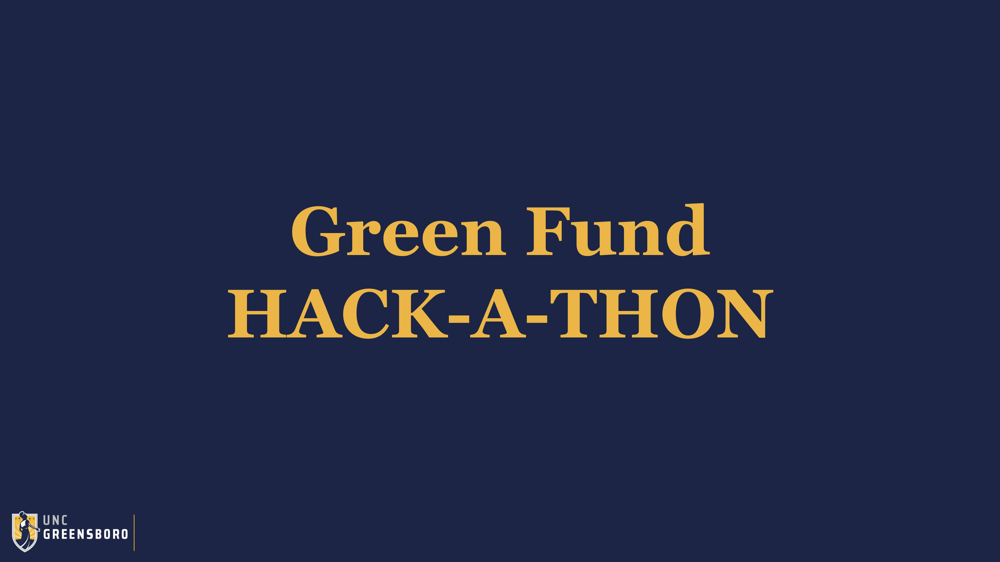

# Green Fund Hack-A-Thon
Fall 2020

<!-- PROJECT LOGO -->
 

  

<!-- ABOUT THE PROJECT -->
## About The Hack-A-Thon

The purpose of this Hack-a-thon is to develop an interactive dashboard to summarize high-frequency energy consumption data in 81 electricity meters on UNCG’s campus. These meters represent power utilization of various buildings across UNCG and will help the university understand the requirements and usage of energy consumption and efficiency across the campus. 

Prior work in the project has achieved scripts to clean, summarize, and predict energy use using statistical models with data on meter readings, local weather conditions, and classroom occupancy. These scripts are written in Python and extract data from various API sources. The available cleaned data is available at: https://github.com/UNCG-DAISY/Green_Hackathon-Fall2020/tree/main/data/Analysis

Participants in this Hack-a-thon are tasked with using the data produced by these scripts to write new scripts that create a real-time dashboard that displays a series of interactive graphs. Teams will be judged based on the interactive graphs, dashboard usability, style and aesthetics, coding and documentation. The dashboard created by the winning team will be deployed and hosted by UNCG for use by Facilities Operations staff and the public.

<!-- LICENSE -->
## License

Distributed under the MIT License. See `LICENSE` for more information.

<!-- CONTACT -->
## Contact

Somya Mohanty - sdmohant@uncg.edu

Will Queen - jwqueen@uncg.edu

<!-- ACKNOWLEDGEMENTS -->
## Acknowledgements
* [UNCG Green Fund](https://sustainability.uncg.edu/green-fund/)
* [Department of Computer Science](https://compsci.uncg.edu/)
* [Bryan School](https://bryan.uncg.edu/)